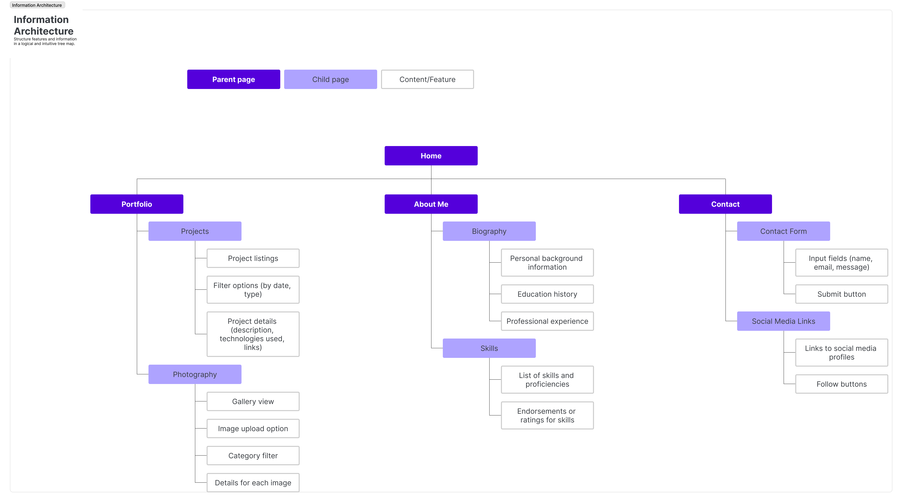
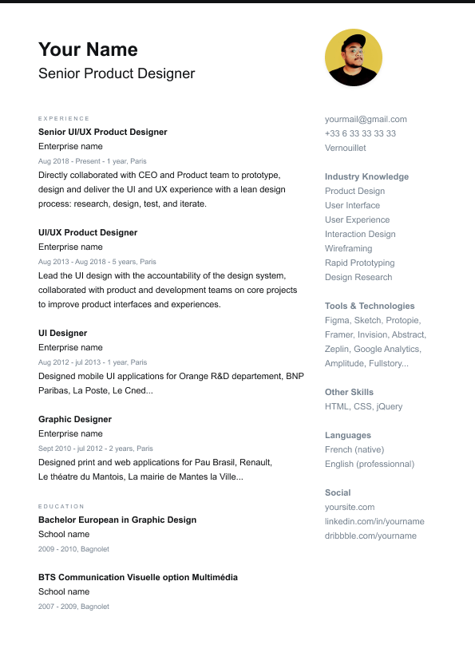
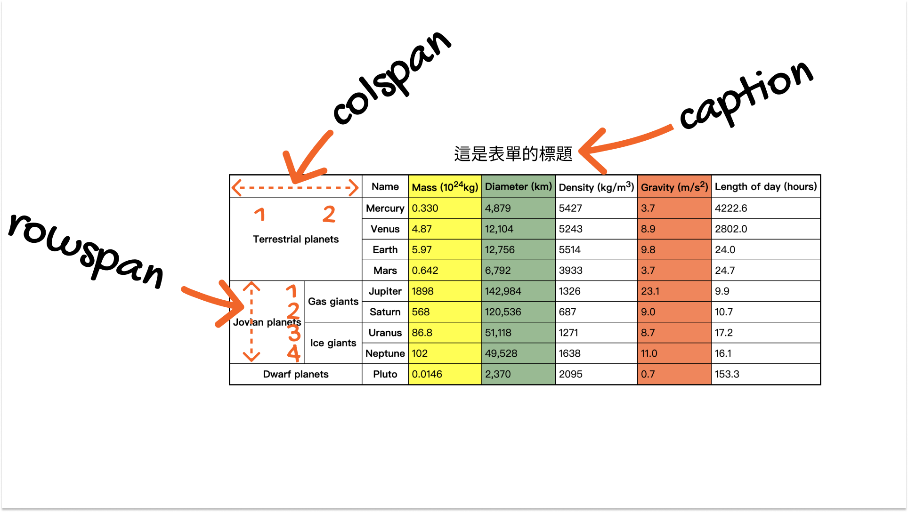
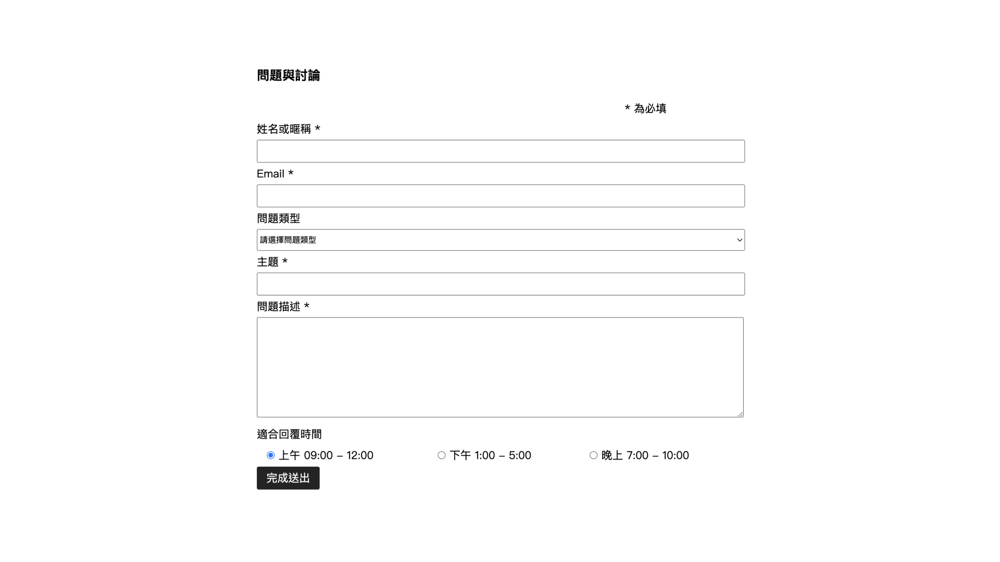
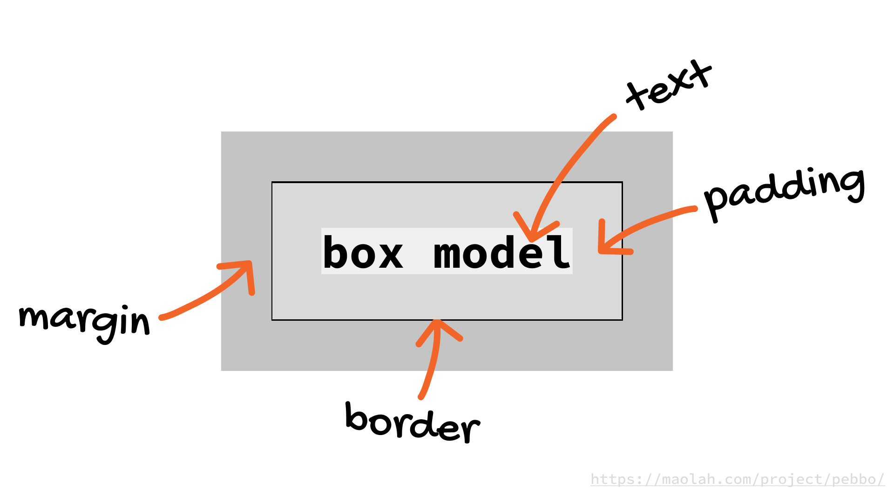

# Lccnet HTML & CSS 初探

## 課程相關連結
- [我的網站](https://iam.troie.fun)
- [加入 Slack 群組](https://troie.slack.com/)
- [編輯器下載](https://brackets.io/)
- [HTML 文件：MDN Web Docs](https://developer.mozilla.org/zh-TW/docs/Web/HTML)
- [github](https://github.com/)
- [github desktop](https://github.com/apps/desktop)
- [同步程式碼](https://github.com/maolahdesign/f2d0808)
- [個人網頁設計檔案](https://www.figma.com/design/r1hQiKxBAfivjwxAHC3ykC/CV-%2F-Resume-(Community)?node-id=0-1&t=eWBY9H4DIPtltWU7-1)


## 我的第一支程式 index.html
```
<!DOCTYPE html>
<html lang="zh-TW">
<head>
    <meta charset="UTF-8">
    <title>Document</title>
</head>
<body>
    <h1>Hello HTML.</h1>
</body>
</html>
```

---
## HTML Site Map
網站地圖 (Sitemap) 是一個文件，通常是 XML 格式，用於列出網站的所有頁面，並告訴搜尋引擎網站的內容結構。這有助於搜尋引擎更有效地抓取和索引網站的頁面。網站地圖可以包含有關每個 URL 的信息，如最後修改日期、變更頻率和相對於其他頁面的優先級。

```
<?xml version="1.0" encoding="UTF-8"?>
<urlset xmlns="http://www.sitemaps.org/schemas/sitemap/0.9">
    
    <!-- 首頁 -->
    <url>
        <loc>https://www.example.com/</loc>
        <lastmod>2024-08-10</lastmod>
        <changefreq>daily</changefreq>
        <priority>1.0</priority>
    </url>
    
    <!-- 資料頁面 -->
    <url>
        <loc>https://www.example.com/protfolio</loc>
        <lastmod>2024-07-20</lastmod>
        <changefreq>monthly</changefreq>
        <priority>0.8</priority>
    </url>
    
    <!-- 關於我們頁面 -->
    <url>
        <loc>https://www.example.com/aboutme</loc>
        <lastmod>2024-08-05</lastmod>
        <changefreq>monthly</changefreq>
        <priority>0.8</priority>
    </url>
    
    <!-- 聯絡我們頁面 -->
    <url>
        <loc>https://www.example.com/contact</loc>
        <lastmod>2024-07-18</lastmod>
        <changefreq>yearly</changefreq>
        <priority>0.5</priority>
    </url>
    
    <!-- 部落格頁面 -->
    <url>
        <loc>https://www.example.com/blog</loc>
        <lastmod>2024-08-12</lastmod>
        <changefreq>weekly</changefreq>
        <priority>0.7</priority>
    </url>

</urlset>
```
---

## 結構元素
### `<div>`
HTML 中的一個**區塊級元素**，用來作為容器包裹其他 HTML 元素，從而控制頁面布局或應用 CSS 樣式。**它通常用於將內容分組以便於樣式設計或腳本控制**。

#### 基本用法
```html
<div>
    <h1>這是標題</h1>
    <p>這是一段文字。</p>
</div>
```

#### 特點
1. **區塊級元素**：`<div>` 是一個區塊級元素，它會佔據一整行的寬度，其後的元素會顯示在下一行。

2. **無語意性**：`<div>` 不帶有任何語意，只是一個容器。因此，**應用樣式或腳本是其主要用途**。

3. **組織和佈局**：在複雜的網頁佈局中，`<div>` 可以**用來包裹和組織多個元素**，並與 CSS 一起使用來設計網頁的結構和風格。

4. **通過 CSS 或 JavaScript 操作**：`<div>` 元素常與 CSS 和 JavaScript 結合使用，以控制其樣式或行為。

#### 例子
```html
<div class="container">
    <header>這是頁首</header>
    <div class="content">
        <p>這是主要內容區。</p>
    </div>
    <footer>這是頁尾</footer>
</div>
```

在這個例子中，`<div>` 元素用來將頁面分為三個部分：`header`、`content` 和 `footer`。這些區塊可以通過 CSS 進行樣式設計或通過 JavaScript 進行動態操作。

---
### `<article>`
HTML5 的一個語意元素，專門用來表示**獨立的內容單元**，如部落格文章、新聞報導、評論、論壇貼文等。這些內容單元通常具有自成一體的意義，並且可以在上下文中單獨存在。

#### 主要特點

1. **語意化**：
   - `<article>` 是語意化的 HTML 元素，這意味著它不僅僅是用來佈局或包裹內容的，還具有描述性，告訴瀏覽器和搜尋引擎該區塊的內容是獨立的可復用單位。

2. **可獨立存在**：
   - 內容可以獨立於頁面或網站的其他部分而存在。例如，RSS 提要中的每個項目通常是一篇獨立的文章，可以用 `<article>` 來包裹。

3. **嵌套**：
   - 可以嵌套使用 `<article>` 元素。例如，一篇部落格文章的主體內容可以包裹在 `<article>` 中，而其內部的評論部分也可以用 `<article>` 來包裹，表示這些評論也是獨立的內容單元。

#### 常見用法

#### 部落格文章
```html
<article>
    <h2>這是部落格文章的標題</h2>
    <p>這是文章的內容段落。</p>
</article>
```

#### 新聞報導
```html
<article>
    <header>
        <h1>新聞標題</h1>
        <p>作者: John Doe | 發佈日期: 2024-08-12</p>
    </header>
    <p>這是一則新聞報導的內容...</p>
</article>
```

#### 嵌套的文章
```html
<article>
    <h2>主要文章標題</h2>
    <p>這是主要文章的內容。</p>
    <article>
        <h3>內嵌文章標題</h3>
        <p>這是內嵌文章的內容，例如評論或相關故事。</p>
    </article>
</article>
```
使用 `<article>` 元素可以幫助改善網頁的結構化數據，使內容更容易被搜尋引擎理解和索引，從而有助於 SEO 優化。

---
### `<section>` 
HTML5 中的一個語意化元素，用來表示 html 中的一個區塊或部分，這個區塊通常有其特定的主題或內容。`<section>` 常用於組織和劃分頁面內容，使得 html 結構更加清晰。

#### 特點

1. **語意化元素**：
   - `<section>` 是一個語意化元素，意在表示 html 中的一個邏輯區塊或部分，這個部分通常圍繞著一個**共同的主題或內容**。

2. **包含標題**：
   - 通常，`<section>` 中應包含標題 (`<h1>` ~ `<h6>`) 來描述該區塊的主題。這有助於結構化內容，並提高可讀性和 SEO（搜尋引擎優化）。

3. **組織內容**：
   - `<section>` 用來組織內容，使網頁更加清晰和結構化。例如，可以用來包裹網頁中的不同部分，如介紹、產品功能、聯絡方式等。

#### 與其他元素的區別

- **與 `<div>` 的區別**：
  - `<div>` 是純粹的布局元素，無語意，通常用於將頁面內容分組並應用樣式或腳本。
  - `<section>` 是語意化的，適合用來劃分有主題內容的區塊。

- **與 `<article>` 的區別**：
  - `<article>` 用於表示一個獨立的、自包含的內容單元，可以單獨存在或被引用，如一篇部落格文章或新聞報導。
  - `<section>` 更適合用來劃分 html 中的不同主題部分，而這些部分通常是 html 的一部分而非獨立內容。

#### 常見用法

#### 範例 1：網頁內容的主要部分
```html
<section>
    <h2>關於我們</h2>
    <p>我們是一家致力於創新的科技公司...</p>
</section>
<section>
    <h2>我們的產品</h2>
    <p>我們提供多種高品質的科技產品...</p>
</section>
```

#### 範例 2：文章中的不同主題區塊
```html
<article>
    <h1>如何學習程式設計</h1>
    <section>
        <h2>選擇一門程式語言</h2>
        <p>學習程式設計的第一步是選擇一門程式語言...</p>
    </section>
    <section>
        <h2>建立學習計劃</h2>
        <p>制定學習計劃能夠幫助你有條理地學習...</p>
    </section>
</article>
```
使用 `<section>` 元素可以幫助你組織頁面結構，使其更加清晰易讀，並且**更容易被搜尋引擎理解和索引**。

---
### `<header>` 
HTML5 語意元素，用來表示網頁或區塊的頭部內容。通常用於包含介紹性的內容或導航連結，例如標題、LOGO、作者信息、導航選單等。

#### 主要特點

1. **語意化元素**：
   - `<header>` 是語意化的元素，表示 html 或區段的開頭部分，通常包含主要的導航和介紹性內容。

2. **可用於多個區段**：
   - `<header>` 不僅可以用在網頁的頂部，還**可以用在 `<article>`、`<section>`、`<aside>` 等元素內部**，以表示這些區塊的頭部。

3. **常見用途**：
   - 包含網站或應用的名稱或標識（例如標誌或標題）。
   - 包含主導航選單。
   - 包含搜尋框或其他與網站頂部相關的內容。

#### 常見用法

##### 範例 1：網站的主要頭部
```html
<header>
    <h1>我的網站名稱</h1>
    <nav>
        <ul>
            <li><a href="#home">首頁</a></li>
            <li><a href="#about">關於我們</a></li>
            <li><a href="#contact">聯絡我們</a></li>
        </ul>
    </nav>
</header>
```

##### 範例 2：文章中的頭部
```html
<article>
    <header>
        <h2>文章標題</h2>
        <p>作者: Troie Pan | 發佈日期: 2024-08-16</p>
    </header>
    <p>這是文章的內容...</p>
</article>
```

#### 使用場景

- **網站的頭部**：用於定義網站的頂部區域，通常包括標誌、標題、主導航等。
- **文章或區塊的頭部**：用於定義特定文章、區段或頁面內部某個部分的頭部，通常包含該部分的標題和相關信息。

#### 注意事項

- **避免重複使用**：在一個頁面中通常應該只有一個網站級別的 `<header>`，但可以在每個獨立的區段內部使用 `<header>`。

使用 `<header>` 元素能夠幫助提高網頁結構的清晰度，使得內容更容易被搜尋引擎和輔助技術理解，從而提升網站的可訪問性和 SEO 效果。

---
### `<footer>` 
HTML5 語意元素，用來表示 html 或區塊的底部內容。通常包括有關頁面或區塊的附加信息，例如版權信息、聯絡方式、社交媒體連結、隱私政策、以及其他相關的輔助性內容。

#### 主要特點

1. **語意化元素**：
   - `<footer>` 是語意化的 HTML 元素，用來描述頁面或區段的結尾部分，包含與該部分相關的輔助內容。

2. **可用於多個區段**：
   - 可以在整個網頁的底部使用 `<footer>`，也可以在 `<article>`、`<section>`、`<aside>` 等元素內部使用，以表示這些區塊的結尾部分。

3. **典型內容**：
   - 版權聲明
   - 聯絡信息
   - 網站地圖
   - 社交媒體連結
   - 版權或法律信息

#### 常見用法

##### 範例 1：網站的主要頁腳
```html
<footer>
    <p>&copy; 2024 我的網站名稱. 版權所有。</p>
    <nav>
        <ul>
            <li><a href="#privacy-policy">隱私政策</a></li>
            <li><a href="#terms-of-service">服務條款</a></li>
            <li><a href="#contact">聯絡我們</a></li>
        </ul>
    </nav>
</footer>
```

###### 範例 2：文章中的頁腳
```html
<article>
    <h2>文章標題</h2>
    <p>這是文章的內容...</p>
    <footer>
        <p>作者: John Doe | 發佈日期: 2024-08-12</p>
        <p>標籤: HTML, CSS, Web Development</p>
    </footer>
</article>
```

#### 使用場景

- **網站的底部區域**：通常包含網站的全局信息，如版權聲明、聯絡方式、隱私政策等。
- **文章或區段的結尾部分**：可以用來顯示作者信息、發佈日期、相關標籤或其他附加信息。

#### 注意事項

- **不要過度使用**：在一個頁面中，通常只有一個全局的 `<footer>`，用來表示整個頁面的結尾部分。不過，如果頁面內有多個獨立的文章或區塊，也可以在這些區塊中使用 `<footer>`。

- **不要與 `<header>` 混淆**：`<footer>` 表示內容的結尾部分，而 `<header>` 表示開頭部分。兩者有著不同的語意和作用。

使用 `<footer>` 能夠有效地組織頁面內容，使頁面結構更加清晰，並有助於提升網頁的可讀性和搜尋引擎優化效果。

---
### `<nav>` 
HTML5 中的一個語意化元素，用來表示網頁中的導航部分。它通常包含指向其他頁面或當前頁面內其他部分的鏈接，如主導航選單、分頁菜單、目錄等。

#### 主要特點

1. **語意化元素**：
   - `<nav>` 是一個語意化元素，表示頁面中包含導航鏈接的區域。

2. **專門用於導航**：
   - 該元素專門用來包裹一組導航鏈接，而不是普通的超鏈接組合。它幫助搜尋引擎和輔助技術（如螢幕閱讀器）識別和定位網站的主要導航部分。

3. **可以包含多個**：
   - 在同一個頁面中可以使用多個 `<nav>` 元素。例如，一個頁面可能有一個主導航欄、一個側邊欄導航以及頁腳中的導航鏈接，每個部分都可以使用 `<nav>` 元素來表示。

#### 常見用法

##### 範例 1：主導航選單
```html
<nav>
    <ul>
        <li><a href="#home">首頁</a></li>
        <li><a href="#about">關於我們</a></li>
        <li><a href="#services">服務</a></li>
        <li><a href="#contact">聯絡我們</a></li>
    </ul>
</nav>
```

##### 範例 2：頁內導航
```html
<article>
    <header>
        <h1>文章標題</h1>
    </header>
    <nav>
        <ul>
            <li><a href="#section1">部分 1</a></li>
            <li><a href="#section2">部分 2</a></li>
            <li><a href="#section3">部分 3</a></li>
        </ul>
    </nav>
    <section id="section1">
        <h2>部分 1</h2>
        <p>這是部分 1 的內容。</p>
    </section>
    <!-- 其他部分內容 -->
</article>
```

#### 使用場景

- **主導航欄**：用於定義網站的主導航部分，通常放在頁面的頂部。
- **側邊欄導航**：用於頁面的側邊欄，方便使用者快速訪問特定的內容或部分。
- **頁內目錄**：用於長文章或 html 的內部導航，使使用者可以快速跳轉到頁面內的特定部分。

#### 注意事項

- **不要濫用**：僅當一組鏈接主要用於導航時，才應使用 `<nav>`。普通的內文鏈接或社交媒體鏈接等不應包裹在 `<nav>` 中。
- **結合 ARIA 屬性**：在某些情況下，與 ARIA 屬性結合使用，可以進一步提高輔助技術的可訪問性。

使用 `<nav>` 元素能夠幫助組織網站的導航結構，使得內容更加清晰，並有助於提升使用者體驗和網站的 SEO。

---
### `<main>` 
HTML5 語意元素，用來表示網頁或應用程式的主要內容。這個元素用於包裹頁面中主要的獨立內容，而這些內容應該與頁面的主要目的一致。

#### 主要特點

1. **語意化元素**：
   - `<main>` 是語意化的，表示頁面的主要內容區域，通常包含與頁面主題相關的主要內容。

2. **唯一性**：
   - 在一個 HTML 文件中應該只使用一次 `<main>` 元素，因為它標示的是頁面的主要內容。

3. **跳過重複內容**：
   - 屏幕閱讀器等輔助技術可以幫助使用者跳過重複的頁頭或導航部分，直接定位到 `<main>` 元素中的主要內容。

4. **排除的內容**：
   - `<main>` 中不應包含側邊欄、頁頭（`<header>`）、頁腳（`<footer>`）或導航（`<nav>`）等重複出現的內容，而應僅包含頁面的核心內容。

#### 常見用法

##### 範例 1：基本結構
```html
<body>
    <header>
        <h1>我的網站</h1>
        <nav>
            <ul>
                <li><a href="#home">首頁</a></li>
                <li><a href="#about">關於我們</a></li>
            </ul>
        </nav>
    </header>
    
    <main>
        <h2>主要內容標題</h2>
        <p>這裡是網站的主要內容...</p>
    </main>
    
    <footer>
        <p>&copy; 2024 我的網站名稱. 版權所有。</p>
    </footer>
</body>
```

#### 範例 2：含有多個區段的頁面
```html
<main>
    <section>
        <h2>第一部分</h2>
        <p>這裡是第一部分的內容...</p>
    </section>
    <section>
        <h2>第二部分</h2>
        <p>這裡是第二部分的內容...</p>
    </section>
</main>
```

#### 使用場景

- **主要內容區域**：頁面中與該頁主要功能或主題相關的內容。
- **跳過導航鏈接**：輔助技術可以幫助使用者跳過頁頭或導航部分，直接定位到 `<main>` 區域中的內容。

#### 注意事項

- **唯一性**：每個頁面應該只包含一個 `<main>` 元素，這有助於輔助技術和搜尋引擎更好地理解頁面結構。
- **避免嵌套**：不要在 `<main>` 中嵌套其他的頁面級別的元素，如 `<header>`、`<footer>` 或 `<nav>`。

使用 `<main>` 元素可以有效提升網頁的語意化結構，並且有助於提升網站的可訪問性和 SEO 效果。

---
### `<aside>` 
HTML5 語意化元素，用來表示與頁面**主內容相關的次要內容或附加信息**。通常用於顯示不屬於主要內容，但與其相關的側邊欄、附加資訊、廣告或引用的文字等。

#### 主要特點

1. **語意化元素**：
   - `<aside>` 是一個語意化元素，表示與主內容相關但相對次要的部分，如側邊欄、相關連結或附加資訊。

2. **用於補充內容**：
   - 這個元素通常包含與頁面**主要內容相關**但非核心的資訊，如附加說明、引用、相關鏈接、作者簡介等。

3. **靈活的定位**：
   - `<aside>` 可以放置在 html 的任何部分，無論是與主內容並排，還是在文章內部，以提供補充信息。

#### 常見用法

##### 範例 1：頁面側邊欄
```html
<aside>
    <h3>相關文章</h3>
    <ul>
        <li><a href="#article1">文章一</a></li>
        <li><a href="#article2">文章二</a></li>
        <li><a href="#article3">文章三</a></li>
    </ul>
</aside>
```

##### 範例 2：文章中的補充內容
```html
<article>
    <h2>主要文章標題</h2>
    <p>這是主要文章的內容...</p>
    
    <aside>
        <p>補充信息：本文章中的數據來自於 2023 年的調查報告。</p>
    </aside>
</article>
```

#### 使用場景

- **側邊欄**：在頁面的一側顯示相關鏈接、附加內容或廣告等。
- **補充信息**：用來展示與主內容相關的補充說明、引用或背景資料。

#### 注意事項

- **與主要內容的關聯**：`<aside>` 中的內容應該與主內容有一定的關聯性，但不應是主內容的核心部分。
- **不要用於不相關的信息**：如果內容與頁面的主題完全無關，不應使用 `<aside>`，而應考慮其他元素或結構。

使用 `<aside>` 元素可以幫助組織頁面中的附加信息，使主內容更加突出，同時提供相關的補充資料或背景信息。

---
### 作業參考 index.html

```
<div class="container">
    <header>
        <nav>
            <a href="index.html">home</a>
            <a href="portfolio.html">portfolio</a>
            <a href="aboutme.html">about</a>
            <a href="contact.html">contact</a>
        </nav>
        Troie Pan
        Senior Product Designer
        
    </header>
    <div class="content">
        <article>
            experience
            Senior UI/UX Product Designer
            Enterprise name
            Aug 2018 - Present - 1 year, Paris
            Directly collaborated with CEO and Product team to prototype, design and deliver the UI and UX experience with a lean design process: research, design, test, and iterate.

            UI/UX Product Designer
            Enterprise name
            Aug 2013 - Aug 2018 - 5 years, Paris
            Lead the UI design with the accountability of the design system, collaborated with product and development teams on core projects to improve product interfaces and experiences.

            UI Designer
            Enterprise name
            Aug 2012 - jul 2013 - 1 year, Paris
            Designed mobile UI applications for Orange R&D departement, BNP Paribas, La Poste, Le Cned...

            Graphic Designer
            Enterprise name
            Sept 2010 - jul 2012 - 2 years, Paris
            Designed print and web applications for Pau Brasil, Renault,
            Le théatre du Mantois, La mairie de Mantes la Ville...

            education
            Bachelor European in Graphic Design
            School name
            2009 - 2010, Bagnolet

            BTS Communication Visuelle option Multimédia
            School name
            2007 - 2009, Bagnolet
        </article>
        <aside>
            yourmail@gmail.com
            +33 6 33 33 33 33
            Vernouillet

            Industry Knowledge
            Product Design
            User Interface
            User Experience
            Interaction Design
            Wireframing
            Rapid Prototyping
            Design Research

            Tools & Technologies
            Figma, Sketch, Protopie, Framer, Invision, Abstract, Zeplin, Google Analytics, Amplitude, Fullstory...

            Other Skills
            HTML, CSS, jQuery

            Languages
            French (native)
            English (professionnal)

            Social
            yoursite.com
            linkedin.com/in/yourname
            dribbble.com/yourname
        </aside>
    </div>  
</div>
```
HTML 標題元素用於定義網頁中的標題或主題，它們用來組織內容，讓瀏覽器和使用者都能清楚地了解網頁結構。HTML 提供了六種標題元素，從 `<h1>` 到 `<h6>`，它們按照重要性依次遞減。

---
### 標題元素

1. **`<h1>`** - 最高層級的標題，通常用於網頁或章節的主要標題。
   - 範例：
     ```html
     <h1>網站標題</h1>
     ```

2. **`<h2>`** - 用於次級標題，通常是 `<h1>` 標題下的子標題。
   - 範例：
     ```html
     <h2>章節標題</h2>
     ```
3. **`<h3>`** - 用於次級的子標題，通常用於 `<h2>` 標題下的更細分的標題。
4. **`<h4>`** - 用於 `<h3>` 標題下的進一步細分。
5. **`<h5>`** - 用於 `<h4>` 標題下的細分，較少使用，適合非常深入的分層內容。
6. **`<h6>`** - 最低層級的標題，通常用於 `<h5>` 標題下的內容。

#### 標題使用最佳實踐
- **語義結構**：標題應該按照層次結構合理使用，避免跳級（例如，直接從 `<h1>` 跳到 `<h4>`），這樣有助於維持清晰的 html 結構。
- **SEO 影響**：搜尋引擎依賴標題來理解內容的結構和主題，因此合理使用標題標籤有助於 SEO。
- **可訪問性**：正確的標題結構可以幫助使用屏幕閱讀器的使用者更好地導航和理解網頁內容。

#### 其他注意事項
- 每個頁面通常只應有一個 `<h1>` 標題，作為頁面的主標題。
- 標題不僅影響頁面結構，還會影響瀏覽器默認樣式和搜尋引擎優化，因此使用時應該謹慎。

這些標題標籤在 HTML 中是必不可少的，因為它們定義了內容的層次結構，使頁面更易於閱讀和理解。

HTML 中的段落是由 `<p>` 標籤定義的。每個 `<p>` 標籤都表示一個獨立的段落，瀏覽器會自動在段落前後添加空白間距，以便更清晰地顯示文字。

### 段落基本用法
- **定義段落**：使用 `<p>` 標籤來包裹段落文字。
  - 範例：
    ```html
    <p>HTML 中的段落是由 p 標籤定義的。每個 p 標籤都表示一個獨立的段落，瀏覽器會自動在段落前後添加空白間距，以便更清晰地顯示文字。</p>
    ```

#### 段落標籤的特點
- **自動換行**：當文字內容超過容器的寬度時，瀏覽器會自動將文字換行。
- **多段落**：可以使用多個 `<p>` 標籤來定義多個段落，每個段落都是獨立的文字區塊。
  - 範例：
    ```html
    <p>這是第一個段落。</p>
    <p>這是第二個段落。</p>
    ```

#### 段落中的其他元素
- **內嵌元素**：段落內可以包含其他內嵌元素，如 `<a>`、`<strong>`、`<em>` 等，用來增加超連結、強調文字或斜體字等。
  - 範例：
    ```html
    <p>這是一個包含 <strong>強調文字</strong> 和 <a href="#">連結</a> 的段落。</p>
    ```

#### 其他注意事項
- **段落內不能嵌套段落**：HTML 規範不允許段落內嵌套其他段落標籤。
- **語義化**：正確使用 `<p>` 標籤可以增強 html 的語義化，使搜尋引擎和輔助技術更容易理解內容結構。

段落是 HTML 中最基本的文字區塊元素之一，使用正確的 `<p>` 標籤來組織內容，有助於提升網頁的可讀性和結構清晰度。

在 HTML 中，文字修飾主要是通過一系列標籤和 CSS 屬性來實現的。這些修飾可以改變文字的外觀，例如粗體、斜體、下劃線等。以下是一些常見的 HTML 文字修飾方式：

### HTML 修飾標籤
#### 1. 粗體文字 (`<strong>` 和 `<b>`)
- **`<strong>`**：表示語義上重要的文字，通常顯示為粗體。
  - 範例：
    ```html
    <p>這是一個<strong>重要的</strong>段落。</p>
    ```
- **`<b>`**：僅用來使文字顯示為粗體，沒有語義上的強調。
  - 範例：
    ```html
    <p>這是一個<b>粗體</b>文字。</p>
    ```

#### 2. 斜體文字 (`<em>` 和 `<i>`)
- **`<em>`**：表示強調的文字，通常顯示為斜體，具有語義上的強調意義。
  - 範例：
    ```html
    <p>這是一個<em>強調</em>的段落。</p>
    ```
- **`<i>`**：僅用來使文字顯示為斜體，沒有語義上的強調。
  - 範例：
    ```html
    <p>這是一個<i>斜體</i>文字。</p>
    ```

#### 3. 下劃線文字 (`<u>`)
- **`<u>`**：將文字顯示為帶有下劃線的形式。通常用於表示文字是超連結的一部分，但也可以用來標示需要注意的文字。
  - 範例：
    ```html
    <p>這是一個<u>帶下劃線</u>的文字。</p>
    ```

#### 4. 刪除線文字 (`<del>` 和 `<s>`)
- **`<del>`**：表示被刪除的文字，通常顯示為帶刪除線的形式，適合在修訂過的 html 中標示被刪除的部分。
  - 範例：
    ```html
    <p>這是一個<del>刪除</del>的文字。</p>
    ```
- **`<s>`**：通常用於標示不再準確或不再相關的文字，顯示為刪除線。
  - 範例：
    ```html
    <p>這是一個<s>過時</s>的文字。</p>
    ```

#### 5. 下標與上標文字 (`<sub>` 和 `<sup>`)
- **`<sub>`**：將文字顯示為下標，通常用於數學公式或化學符號。
  - 範例：
    ```html
    <p>H<sub>2</sub>O 是水的化學式。</p>
    ```
- **`<sup>`**：將文字顯示為上標，通常用於指數或註解。
  - 範例：
    ```html
    <p>2<sup>nd</sup> 是第二的縮寫。</p>
    ```

#### 6. 等寬字體 (`<code>` 和 `<pre>`)
- **`<code>`**：用來標示程式碼片段，顯示為等寬字體，適合在 html 中標示代碼。
  - 範例：
    ```html
    <p>請使用 <code>console.log()</code> 來輸出訊息。</p>
    ```
- **`<pre>`**：保留文字中的所有空格和換行，並以等寬字體顯示，適合用來顯示格式化的文字，如程式碼段落。
  - 範例：
    ```html
    <pre>
    function test() {
    console.log("Hello, world!");
    }
    </pre>
    ```

#### 7. 引用 (`<blockquote>` 和 `<q>`)
- **`<blockquote>`**：用來標示一段較長的引用，通常會增加縮排。
  - 範例：
    ```html
    <blockquote>
      這是一段引用的文字，來自某個來源。
    </blockquote>
    ```
- **`<q>`**：用來標示行內引用，通常會加上引號。
  - 範例：
    ```html
    <p>莎士比亞說過：<q>人生如戲。</q></p>
    ```

#### 8. 強調 (`<mark>`)
- **`<mark>`**：用來高亮顯示文字，表示它在上下文中有重要性或相關性。
  - 範例：
    ```html
    <p>這是一個<mark>高亮顯示</mark>的文字。</p>
    ```

這些 HTML 標籤可以幫助你有效地修飾網頁中的文字，使其更具可讀性和結構性。同時，使用這些標籤還能提升網頁的語義化和可訪問性。

---
### 註解
在 HTML 中，註解（Comment）是一種不會被瀏覽器顯示或渲染的文字，通常用於註釋代碼、標記重要部分或解釋代碼片段的用途。註解對於開發者來說非常有用，有助於增強代碼的可讀性和可維護性。

#### HTML 註解的基本語法

```html
<!-- 這是一個註解 -->
```

註解的內容放在 `<!--` 和 `-->` 之間，瀏覽器會忽略這部分內容。

#### 註解的應用場景

1. **標記代碼段落**：可以用註解來分隔和標記代碼片段，方便以後查看和修改。
   ```html
   <!-- 網頁標題部分開始 -->
   <header>
       <h1>我的網站</h1>
   </header>
   <!-- 網頁標題部分結束 -->
   ```

2. **註釋代碼邏輯**：在代碼中添加註解來解釋複雜的邏輯或操作，使代碼更容易理解。
   ```html
   <!-- 如果使用者已登錄，顯示個人信息 -->
   ```

3. **暫時禁用代碼**：當你需要暫時禁用某段 HTML 代碼時，可以將其包裹在註解中。
   ```html
   <!--
   <div class="disabled-section">
       這段代碼將不會被渲染
   </div>
   -->
   ```

#### 注意事項

- **不嵌套**：HTML 註解不支持嵌套，如果在註解內再插入 `<!--` 或 `-->`，可能會導致註解意外結束或代碼渲染錯誤。
  
- **簡潔明了**：註解應該簡潔明瞭，避免過於冗長。適當的註解能夠幫助其他開發者快速理解代碼。

- **註解不應包含敏感信息**：避免在註解中包含密碼、API 密鑰等敏感信息，因為這些信息可能會被暴露給查看源代碼的使用者。

註解在代碼中扮演著重要的角色，能夠提升代碼的可讀性和可維護性，是開發過程中不可或缺的一部分。

---
### 聯絡資訊
在 HTML 中，`<address>` 標籤用來定義聯絡信息或地址，通常包含電子郵件地址、電話號碼、實體地址等。這個標籤的使用有助於結構化聯絡信息，使其對於搜尋引擎和輔助技術更具語義性。

#### `<address>` 標籤的基本用法
- **用途**：用於包裹網頁上某個聯絡人的聯絡信息，通常會在頁腳或關於我們頁面使用。
- **內容**：內容可以包括地址、電話號碼、電子郵件、聯絡人名稱等，並且可以包含內嵌標籤如 `<a>` 來添加超連結。

#### 範例
```html
<address>
    <strong>公司名稱：</strong>Tech Solutions<br>
    <strong>地址：</strong>12345 網路街, 台北市, 台灣<br>
    <strong>電話：</strong><a href="tel:+886123456789">+886 123 456 789</a><br>
    <strong>電子郵件：</strong><a href="mailto:info@techsolutions.com">info@techsolutions.com</a>
</address>
```

#### 注意事項
1. **語義化**：`<address>` 標籤是語義化標籤，使用它來包裹聯絡信息有助於增強網頁的語義結構。
2. **不適合每個聯絡信息**：該標籤專門用於作者或擁有者的聯絡信息，而不應用於其他類型的地址或聯絡方式。例如，不應使用 `<address>` 來包裹顧客的地址。
3. **CSS 樣式**：`<address>` 標籤的默認樣式通常是斜體顯示，但這可以通過 CSS 來調整。

#### 標籤作用
- **SEO 影響**：搜尋引擎會識別 `<address>` 標籤，將其內容視為聯絡信息，有助於搜尋引擎結果頁面（SERP）顯示正確的信息片段。
- **可訪問性**：對於使用屏幕閱讀器的使用者，`<address>` 標籤提供了語義線索，幫助他們識別網頁上的聯絡信息。

使用 `<address>` 標籤來定義聯絡信息，可以讓網頁內容更加語義化，有助於提升網頁的可讀性、SEO 和可訪問性。

---
### 插入圖片
HTML 中的 `` 標籤用於在網頁中插入圖片。這個標籤是一個自閉合標籤，表示它不需要閉合標籤。下面是 `` 標籤的基本結構及常用屬性：


#### 基本結構
```html

```

#### 常用屬性
1. **`src`（來源）[取得圖片](https://www.pexels.com/zh-tw/)**：
   - 用於指定圖片的路徑，可以是相對路徑或絕對路徑。
   - 範例：
     ```html
     
     ```

2. **`alt`（替代文字）**：
   - 提供圖片的替代文字，用於當圖片無法加載時顯示，或在使用屏幕閱讀器時為使用者讀出。
   - 範例：
     ```html
     
     ```

3. **`width` 和 `height`**：
   - 設定圖片的顯示寬度和高度，可以使用像素（px）或百分比（%）。
   - 範例：
     ```html
     
     ```

4. **`title`**：
   - 提供圖片的標題，當使用者懸停在圖片上時會顯示此文字。
   - 範例：
     ```html
     
     ```

5. **`loading`**：
   - 控制圖片的載入方式，可以設定為 `lazy`（延遲加載）或 `eager`（立即加載）。
   - 範例：
     ```html
     
     ```

6. **`srcset` 和 `sizes`**：
   - `srcset` 用於提供多種圖片文件的列表，以適應不同的屏幕分辨率。
   - `sizes` 定義當前視口條件下，應選擇 `srcset` 中哪個圖片。
   - 範例：
     ```html
     
     ```

#### 其他注意事項
- **SEO 和可訪問性**：為了提升 SEO 和可訪問性，`alt` 屬性應該提供有意義的描述，而不是僅僅重複文件名。
- **圖片格式**：支持的圖片格式包括 JPEG、PNG、GIF、SVG 和 WebP 等，選擇合適的格式可以在保證質量的同時減少加載時間。
- **自適應設計**：在設計響應式網站時，使用 `srcset` 和 `sizes` 可以幫助根據使用者設備的不同自動選擇最佳的圖片。

`` 標籤是 HTML 中非常重要的元素，它不僅僅用於美化網頁，還對於網頁的 SEO 和可訪問性有著重要影響。合理使用 `alt` 屬性、`srcset` 和其他屬性可以提升使用者體驗並優化頁面加載速度。

---
### 列表
在 HTML 中，列表用來組織和顯示一組相關的項目。HTML 支持三種主要類型的列表：有序列表（`<ol>`）、無序列表（`<ul>`）和描述列表（`<dl>`）。

#### 1. 有序列表 (`<ol>`)
有序列表用於表示一組有順序的項目，通常以數字、字母或羅馬數字來標示每個項目。

- **基本結構**：
  ```html
  <ol>
    <li>第一項</li>
    <li>第二項</li>
    <li>第三項</li>
  </ol>
  ```

- **屬性**：
  - `type`：定義列表項的標號類型（數字、字母等）。
    - 範例：
      ```html
      <ol type="A">
        <li>第一項</li>
        <li>第二項</li>
      </ol>
      ```
  - `start`：定義列表從哪個數字開始。
    - 範例：
      ```html
      <ol start="5">
        <li>第五項</li>
        <li>第六項</li>
      </ol>
      ```

#### 2. 無序列表 (`<ul>`)
無序列表用於表示一組無特定順序的項目，通常以圓點、方塊或其他符號標示每個項目。

- **基本結構**：
  ```html
  <ul>
    <li>第一項</li>
    <li>第二項</li>
    <li>第三項</li>
  </ul>
  ```

- **屬性**：
  - `type`：定義項目符號的類型（圓點、方塊等）。
    - 範例：
      ```html
      <ul type="square">
        <li>第一項</li>
        <li>第二項</li>
      </ul>
      ```

#### 3. 描述列表 (`<dl>`)
描述列表用於顯示一組術語及其描述，通常用於定義列表或詞彙表。

- **基本結構**：
  ```html
  <dl>
    <dt>HTML</dt>
    <dd>一種用於建立網頁的標記語言。</dd>
  
    <dt>CSS</dt>
    <dd>用於描述 HTML 文件樣式的樣式表語言。</dd>
  </dl>
  ```

- **元素**：
  - `<dt>`：定義術語或名稱。
  - `<dd>`：定義術語的描述或解釋。

#### 列表中的嵌套
你可以將一個列表嵌套在另一個列表中，以表示分層結構。例如，在無序列表中嵌套有序列表。

- **範例**：
  ```html
  <ul>
    <li>水果
      <ol>
        <li>蘋果</li>
        <li>香蕉</li>
      </ol>
    </li>
    <li>蔬菜
      <ul>
        <li>胡蘿蔔</li>
        <li>菠菜</li>
      </ul>
    </li>
  </ul>
  ```

HTML 列表提供了靈活的方式來組織和展示相關內容，並且能夠通過 CSS 進行進一步的美化。選擇合適的列表類型可以讓你的網頁更加結構化和易讀。

### 建立連結
HTML 中的 `<a>` 標籤（Anchor Tag）用於創建超連結，這是網頁中最基本的互動元素之一。通過超連結，使用者可以從當前頁面跳轉到其他頁面、文件或位置。

#### 基本結構
```html
<a href="https://www.example.com">訪問範例網站</a>
```
這段代碼會在頁面上顯示「訪問範例網站」的文字，點擊後將帶你到 `https://www.example.com`。

#### 主要屬性
1. **`href`（必填屬性）**：
   - 指定要鏈接到的目標 URL。如果這個屬性沒有設置或空白，`<a>` 標籤不會成為超連結。
   - 範例：
     ```html
     <a href="https://www.example.com">範例網站</a>
     ```

2. **`target`**：
   - 定義連結打開的方式，常見的值包括：
     - `_self`：在同一瀏覽器窗口或標籤中打開（默認行為）。
     - `_blank`：在新窗口或新標籤中打開。
   - 範例：
     ```html
     <a href="https://www.example.com" target="_blank">在新標籤打開範例網站</a>
     ```

3. **`rel`**：
   - 定義連結與當前頁面之間的關係。常見值包括：
     - `noopener` 和 `noreferrer`：當 `target="_blank"` 時，用於安全考慮，防止新開頁面獲取原頁面的 `window.opener`。
     - `nofollow`：告訴搜尋引擎不要跟隨此鏈接。
   - 範例：
     ```html
     <a href="https://www.example.com" target="_blank" rel="noopener noreferrer">安全鏈接</a>
     ```

4. **`title`**：
   - 提供連結的額外信息，當使用者將滑鼠懸停在連結上時會顯示。
   - 範例：
     ```html
     <a href="https://www.example.com" title="範例網站的首頁">範例網站</a>
     ```

5. **`download`**：
   - 當連結指向的是文件時，這個屬性會提示使用者下載該文件，而不是在瀏覽器中打開。
   - 範例：
     ```html
     <a href="files/guide.pdf" download>下載指南</a>
     ```

#### 錨點連結
你可以使用 `<a>` 標籤創建錨點連結，以便在同一頁面內快速跳轉到特定部分。

- **定義錨點**：
  ```html
  <h2 id="section1">第一部分</h2>
  ```
  
- **跳轉到錨點**：
  ```html
  <a href="#section1">跳到第一部分</a>
  ```

#### 相對與絕對路徑
- **相對路徑**：指向相對於當前 html 位置的資源。
  ```html
  <a href="about.html">關於我們</a>
  ```
- **絕對路徑**：包含完整的 URL，指向網站上的特定資源。
  ```html
  <a href="https://www.example.com/about.html">關於我們</a>
  ```

#### 超連結的應用
`<a>` 標籤廣泛應用於導航欄、文字鏈接、圖片鏈接、按鈕等。合理使用屬性可以提升使用者體驗並改善網站的 SEO。

HTML 中的 `<a>` 標籤不僅是實現網頁之間連結的基礎，也是豐富使用者互動、提升網站可用性的重要元素。

---
### 空元素
HTML 中的「空元素」是指那些不包含任何內容（例如文字或其他元素）的元素。這些元素通常用來執行特定的功能或表示某些特性，而不需要包含任何內容。空元素在標記語法上是自閉合的，這意味著它們不需要閉合標籤。這類元素主要用於簡化結構並保持標記的簡潔性。

#### 常見的 HTML 空元素
以下是一些常見的 HTML 空元素：

1. **`<br>`**：表示換行。
   - 用於在文字中插入一個換行符號，強制換行。
   - 範例：
     ```html
     這是一段文字。<br>這是新行的開始。
     ```

2. **``**：用來插入圖片。
   - 用於在網頁中顯示圖片，需要設置 `src` 屬性來指定圖片的路徑。
   - 範例：
     ```html
     
     ```

3. **`<input>`**：用來創建各種形式的輸入欄位。
   - 用於表單中，創建文字框、按鈕、選擇框等輸入元素。
   - 範例：
     ```html
     <input type="text" placeholder="輸入你的名字">
     ```

4. **`<hr>`**：表示水平線，用於分隔內容。
   - 通常用來在網頁中分隔不同部分的內容。
   - 範例：
     ```html
     <hr>
     ```

5. **`<meta>`**：用來提供有關 HTML 文件的元數據。
   - 通常用於指定字符編碼、關鍵詞、描述等信息。
   - 範例：
     ```html
     <meta charset="UTF-8">
     ```

6. **`<link>`**：用來定義文件之間的關聯。
   - 通常用於在 HTML 中連接外部資源，如樣式表。
   - 範例：
     ```html
     <link rel="stylesheet" href="styles.css">
     ```

7. **`<source>`**：用來指定多媒體元素（如 `<video>` 和 `<audio>`）的多個資源。
   - 範例：
     ```html
     <video controls>
       <source src="movie.mp4" type="video/mp4">
       <source src="movie.ogg" type="video/ogg">
       瀏覽器不支持該視頻標籤。
     </video>
     ```

8. **`<area>`**：用來定義圖像映射中的區域。
   - 與 `<map>` 元素一起使用，用於創建可點擊區域的圖像映射。
   - 範例：
     ```html
     
     <map name="planetmap">
       <area shape="rect" coords="0,0,82,126" href="sun.htm" alt="Sun">
     </map>
     ```

9. **`<col>`**：用來指定表格中的列屬性。
   - 通常與 `<colgroup>` 一起使用，用於指定表格列的樣式。
   - 範例：
     ```html
     <table>
       <colgroup>
         <col style="background-color:yellow">
         <col style="background-color:green">
       </colgroup>
       <tr><td>1</td><td>2</td></tr>
     </table>
     ```

#### 注意事項
- **自閉合語法**：在 HTML5 中，空元素可以直接使用閉合標籤，如 `<br>`，而不需要在結尾加上斜線 (`/`)。
- **功能用途**：這些空元素的主要功能是簡化代碼結構，並且在沒有內容的情況下能夠實現特定的功能或效果。

空元素在 HTML 中具有重要的作用，能夠使網頁結構更加清晰簡潔，有助於實現網頁的各種功能。

HTML 符號代碼和實體（HTML Symbol Codes and Entities）允許在網頁中顯示特定的符號或特殊字符。這些符號通常是無法直接在 HTML 中使用的，因為它們可能與 HTML 語法有衝突或無法在所有瀏覽器中正確顯示。因此，HTML 實體提供了一種方式來顯示這些字符。

---
### 特殊符號 `& + € ©`
- [HTML symbol codes and entities](https://www.toptal.com/designers/htmlarrows/)

1. **空格和控制字符**：
   - `&nbsp;`：不換行空格（Non-breaking space）
   - `&lt;`：小於號 `<`
   - `&gt;`：大於號 `>`
   - `&amp;`：與號 `&`
   - `&quot;`：雙引號 `"`
   - `&apos;`：單引號 `'`

2. **貨幣符號**：
   - `&dollar;` 或 `&#36;`：美元符號 `$`
   - `&euro;` 或 `&#8364;`：歐元符號 `€`
   - `&pound;` 或 `&#163;`：英鎊符號 `£`
   - `&yen;` 或 `&#165;`：日元符號 `¥`

3. **標點符號**：
   - `&copy;` 或 `&#169;`：版權符號 `©`
   - `&reg;` 或 `&#174;`：註冊商標符號 `®`
   - `&trade;` 或 `&#8482;`：商標符號 `™`

4. **數學符號**：
   - `&plus;` 或 `&#43;`：加號 `+`
   - `&minus;` 或 `&#8722;`：減號 `−`
   - `&times;` 或 `&#215;`：乘號 `×`
   - `&divide;` 或 `&#247;`：除號 `÷`
   - `&equals;` 或 `&#61;`：等號 `=`

5. **箭頭**：
   - `&larr;` 或 `&#8592;`：左箭頭 `←`
   - `&uarr;` 或 `&#8593;`：上箭頭 `↑`
   - `&rarr;` 或 `&#8594;`：右箭頭 `→`
   - `&darr;` 或 `&#8595;`：下箭頭 `↓`

#### 使用方式

在 HTML 文件中，這些符號和實體可以直接寫在文字中。例如：

```html
<p>5 &gt; 3 並且 2 &lt; 4</p>
```

這行代碼將顯示為：

5 > 3 並且 2 < 4

#### 注意事項

- **區分大小寫**：HTML 實體是區分大小寫的，確保正確使用大小寫來顯示所需的字符。
- **兼容性**：雖然大多數實體在現代瀏覽器中都能正常顯示，但某些實體可能在舊版瀏覽器或不同的字符編碼設置下不一致。因此，最好測試不同的情況。

---
### 表格 `<table>`
HTML 中的 `<table>` 元素用來表示表格數據，允許在網頁中顯示有組織的行和列。表格通常用於顯示結構化的信息，如資料表、時間表等。

#### 基本結構

```html
<table>
  <caption>表格標題（可選）</caption>
  <thead>
    <tr>
      <th>標題1</th>
      <th>標題2</th>
      <th>標題3</th>
    </tr>
  </thead>
  <tbody>
    <tr>
      <td>數據1</td>
      <td>數據2</td>
      <td>數據3</td>
    </tr>
    <tr>
      <td>數據4</td>
      <td>數據5</td>
      <td>數據6</td>
    </tr>
  </tbody>
  <tfoot>
    <tr>
      <td colspan="3">表格總計（可選）</td>
    </tr>
  </tfoot>
</table>
```

#### 主要元素

- **`<table>`**：整個表格的容器。
- **`<caption>`**：表格的標題，用於描述表格的內容。通常出現在表格的頂部。
- **`<thead>`**：定義表格的表頭部分，通常包含列的標題。
- **`<tbody>`**：表格的主體部分，包含數據行。
- **`<tfoot>`**：定義表格的表尾部分，通常用於顯示總計或註解。
- **`<tr>`**：表格中的一行。
- **`<th>`**：表格頭部單元格，通常包含列標題，默認字體加粗且居中。
- **`<td>`**：表格中的數據單元格。

#### 範例解釋

- **表頭 (`<thead>`)**: 包含表格的列標題，這些標題通常描述列中數據的類型或內容。
- **表體 (`<tbody>`)**: 包含實際的數據行。每行使用 `<tr>` 元素，行中的每個數據項使用 `<td>` 元素表示。
- **表尾 (`<tfoot>`)**: 可以包含一些總計、摘要或其他註解信息，通常位於表格的底部。

#### 使用場景

- **數據展示**：顯示有結構的數據，如統計數據、比較表等。
- **排版控制**：在需要精確控制行列排版時，可以使用表格來進行布局。
- **表格佈局（不建議）**：雖然 HTML 表格曾經被用於佈局，但現代網頁設計中更推薦使用 CSS 進行布局。

#### 注意事項

- **可訪問性**：為了增強可訪問性，應該使用 `<th>` 來明確列標題，並可選擇添加 `scope` 屬性來進一步指示標題的適用範圍。
- **避免表格佈局**：盡量避免使用表格進行佈局，這樣做會讓 HTML 結構更加複雜，且不利於 SEO 和可訪問性。建議使用 CSS Flexbox 或 Grid 來進行佈局。

#### 試試看


---
### 表單 `<form>`
HTML 表單（Form）是用來收集使用者輸入資料並將其傳送到伺服器處理的一個網頁元素。以下是使用 HTML 表單的基本說明：

#### `<form>`

表單的基本結構由 `<form>` 標籤包裹起來，並可設置一些屬性來指定表單的行為：

```html
<form action="submit_url" method="post">
  <!-- 表單元素 -->
</form>
```

- **`action`**: 指定表單數據提交的目的地（URL）。
- **`method`**: 指定數據傳輸的方式，一般為 `"post"` 或 `"get"`。

#### 表單元素

表單內可以包含各種不同的輸入元素：

##### 輸入文字 `<input type="text">`

用於輸入單行文字：

```html
<label for="username">帳號:</label>
<input type="text" id="username" name="username">
```

##### 輸入密碼 `<input type="password">`

用於輸入密碼，輸入的內容會被隱藏：

```html
<label for="password">密碼:</label>
<input type="password" id="password" name="password">
```

##### 單選按鈕 `<input type="radio">`

讓使用者在多個選項中選擇一個：

```html
<p>性別:</p>
<input type="radio" id="male" name="gender" value="male">
<label for="male">男</label><br>
<input type="radio" id="female" name="gender" value="female">
<label for="female">女</label>
```

##### 複選框 `<input type="checkbox">`

讓使用者選擇多個選項：

```html
<p>興趣:</p>
<input type="checkbox" id="sports" name="interest" value="sports">
<label for="sports">運動</label><br>
<input type="checkbox" id="music" name="interest" value="music">
<label for="music">音樂</label>
```

##### 下拉選單 `<select>`

讓使用者從下拉列表中選擇一個選項：

```html
<label for="country">國家:</label>
<select id="country" name="country">
  <option value="taiwan">台灣</option>
  <option value="japan">日本</option>
  <option value="usa">美國</option>
</select>
```

##### 2.6. 文字區塊 `<textarea>`

用於輸入多行文字：

```html
<label for="message">留言:</label>
<textarea id="message" name="message" rows="4" cols="50"></textarea>
```

##### 2.7. 按鈕 `<input type="submit">`

用來提交表單數據到伺服器：

```html
<input type="submit" value="完成送出">
```

#### 3. 表單驗證

HTML 提供了基本的表單驗證功能，可以使用以下屬性：

- **`required`**: 必填欄位。
- **`pattern`**: 使用正規表示式驗證輸入內容。
- **`maxlength`**: 限制輸入的最大字數。

範例：

```html
<input type="email" id="email" name="email" required>
```

#### 4. 完整範例

```html
<form action="/submit_form" method="post">
  <label for="username">帳號:</label>
  <input type="text" id="username" name="username" required><br><br>

  <label for="password">密碼:</label>
  <input type="password" id="password" name="password" required><br><br>

  <label for="gender">性別:</label>
  <input type="radio" id="male" name="gender" value="male">男
  <input type="radio" id="female" name="gender" value="female">女<br><br>

  <label for="country">國家:</label>
  <select id="country" name="country">
    <option value="taiwan">台灣</option>
    <option value="japan">日本</option>
    <option value="usa">美國</option>
  </select><br><br>

  <label for="message">留言:</label>
  <textarea id="message" name="message" rows="4" cols="50"></textarea><br><br>

  <input type="submit" value="完成送出">
</form>
```

這是 HTML 表單使用的基本介紹，使用表單可以讓使用者將數據發送到伺服器，並且可以通過不同的表單元素來收集各種不同類型的資料。

---
####`<input>` 元素是 HTML 表單中最常用的元素之一，通過設置 `type` 屬性，你可以創建不同類型的輸入欄位。以下是常見的 `input` 類型及其用途：

##### 1. **`type="text"`**
   - **描述**: 單行文字輸入。
   - **用途**: 用於輸入一般文字。
   - **範例**:
     ```html
     <input type="text" name="username">
     ```

##### 2. **`type="password"`**
   - **描述**: 密碼輸入框，輸入內容會隱藏。
   - **用途**: 用於輸入密碼。
   - **範例**:
     ```html
     <input type="password" name="password">
     ```

##### 3. **`type="email"`**
   - **描述**: 電子郵件地址輸入框。
   - **用途**: 用於輸入和驗證電子郵件地址。
   - **範例**:
     ```html
     <input type="email" name="email">
     ```

##### 4. **`type="number"`**
   - **描述**: 數字輸入框。
   - **用途**: 用於輸入數字，可以設定 `min` 和 `max` 屬性來限制數值範圍。
   - **範例**:
     ```html
     <input type="number" name="quantity" min="1" max="10">
     ```

##### 5. **`type="radio"`**
   - **描述**: 單選按鈕。
   - **用途**: 讓使用者在多個選項中選擇一個。
   - **範例**:
     ```html
     <input type="radio" name="gender" value="male"> 男
     <input type="radio" name="gender" value="female"> 女
     ```

##### 6. **`type="checkbox"`**
   - **描述**: 複選框。
   - **用途**: 讓使用者選擇多個選項。
   - **範例**:
     ```html
     <input type="checkbox" name="interest" value="sports"> 運動
     <input type="checkbox" name="interest" value="music"> 音樂
     ```

##### 7. **`type="submit"`**
   - **描述**: 提交按鈕。
   - **用途**: 用於提交表單數據到伺服器。
   - **範例**:
     ```html
     <input type="submit" value="提交">
     ```

##### 8. **`type="reset"`**
   - **描述**: 重設按鈕。
   - **用途**: 重置表單中所有輸入的值為初始值。
   - **範例**:
     ```html
     <input type="reset" value="重置">
     ```

##### 9. **`type="button"`**
   - **描述**: 普通按鈕。
   - **用途**: 通常用來觸發 JavaScript 函數，不會自動提交表單。
   - **範例**:
     ```html
     <input type="button" value="點擊我" onclick="alert('按鈕被點擊!')">
     ```

##### 10. **`type="date"`**
   - **描述**: 日期選擇器。
   - **用途**: 用於選擇日期。
   - **範例**:
     ```html
     <input type="date" name="birthday">
     ```

##### 11. **`type="time"`**
   - **描述**: 時間選擇器。
   - **用途**: 用於選擇時間。
   - **範例**:
     ```html
     <input type="time" name="meeting-time">
     ```

##### 12. **`type="color"`**
   - **描述**: 顏色選擇器。
   - **用途**: 用於選擇顏色。
   - **範例**:
     ```html
     <input type="color" name="favcolor">
     ```

##### 13. **`type="file"`**
   - **描述**: 文件選擇器。
   - **用途**: 用於上傳文件。
   - **範例**:
     ```html
     <input type="file" name="upload">
     ```

##### 14. **`type="hidden"`**
   - **描述**: 隱藏輸入欄位。
   - **用途**: 用於在表單中傳遞隱藏的數據，不會顯示在網頁上。
   - **範例**:
     ```html
     <input type="hidden" name="userID" value="12345">
     ```

##### 15. **`type="tel"`**
   - **描述**: 電話號碼輸入框。
   - **用途**: 用於輸入電話號碼。
   - **範例**:
     ```html
     <input type="tel" name="phone">
     ```

##### 16. **`type="url"`**
   - **描述**: URL 輸入框。
   - **用途**: 用於輸入和驗證網址。
   - **範例**:
     ```html
     <input type="url" name="website">
     ```

##### 17. **`type="range"`**
   - **描述**: 範圍選擇器。
   - **用途**: 用於選擇一個數值範圍內的值（滑桿）。
   - **範例**:
     ```html
     <input type="range" name="volume" min="0" max="100">
     ```

##### 18. **`type="search"`**
   - **描述**: 搜索框。
   - **用途**: 用於輸入搜索查詢。
   - **範例**:
     ```html
     <input type="search" name="query">
     ```

這些不同的 `input` 類型可以幫助你構建豐富且功能多樣的表單，以適應各種使用者輸入需求。

##### 試試看




---

## 我的第一支 CSS
在 HTML 文件中連結 CSS（串接樣式表）可以用來控制網頁的外觀和佈局。以下是幾種常見的方式來連結 CSS 文件或內嵌 CSS 樣式到 HTML 中。

### 行內 CSS
直接在 HTML 標籤中使用 `style` 屬性來定義樣式。這種方法通常只用於少量的樣式定義，不推薦大量使用。

#### 範例：

```html
<!DOCTYPE html>
<html lang="zh-TW">
<head>
    <meta charset="UTF-8">
    <meta name="viewport" content="width=device-width, initial-scale=1.0">
    <title>我的網頁</title>
</head>
<body>
    <h1 style="color: #007BFF;">歡迎來到我的網站</h1>
    <p style="font-size: 16px; line-height: 1.5;">這是範例內容。</p>
</body>
</html>
```

### 內嵌式 CSS
將 CSS 直接寫在 HTML 文件中的 `<style>` 標籤內。

#### 範例：

```html
<!DOCTYPE html>
<html lang="zh-TW">
<head>
    <meta charset="UTF-8">
    <meta name="viewport" content="width=device-width, initial-scale=1.0">
    <title>我的網頁</title>
    <style>
        body {
            font-family: Arial, sans-serif;
            background-color: #f0f0f0;
            color: #333;
        }

        h1 {
            color: #007BFF;
        }

        p {
            font-size: 16px;
            line-height: 1.5;
        }
    </style>
</head>
<body>
    <h1>歡迎來到我的網站</h1>
    <p>這是範例內容。</p>
</body>
</html>
```

### 外部連結 CSS 文件
這是最常用的方式，將一個獨立的 CSS 文件連結到 HTML 文件中。

#### 步驟：
1. 創建一個 `.css` 文件（例如 `styles.css`）。
2. 在你的 HTML 文件的 `<head>` 部分中使用 `<link>` 標籤連結該 CSS 文件。

#### 範例：

```html
<!DOCTYPE html>
<html lang="zh-TW">
<head>
    <meta charset="UTF-8">
    <meta name="viewport" content="width=device-width, initial-scale=1.0">
    <title>我的網頁</title>
    <link rel="stylesheet" href="styles.css">
</head>
<body>
    <h1>歡迎來到我的網站</h1>
    <p>這是範例內容。</p>
</body>
</html>
```

在這個範例中，`styles.css` 文件將包含控制 HTML 文件樣式的所有 CSS 規則。

#### `styles.css` 的範例內容：

```css
body {
    font-family: Arial, sans-serif;
    background-color: #f0f0f0;
    color: #333;
}

h1 {
    color: #007BFF;
}

p {
    font-size: 16px;
    line-height: 1.5;
}
```

### 引入多個 CSS 文件

你可以在 `<head>` 中連結多個 CSS 文件，它們會按照引入的順序被應用，後者會覆蓋前者的相同樣式規則。

#### 範例：

```html
<!DOCTYPE html>
<html lang="zh-TW">
<head>
    <meta charset="UTF-8">
    <meta name="viewport" content="width=device-width, initial-scale=1.0">
    <title>我的網頁</title>
    <link rel="stylesheet" href="reset.css"> <!-- 用於重置默認樣式 -->
    <link rel="stylesheet" href="main.css">  <!-- 主樣式表 -->
</head>
<body>
    <h1>歡迎來到我的網站</h1>
    <p>這是範例內容。</p>
</body>
</html>
```

### 總結

- **外部 CSS**：最常用，將樣式與結構分離，便於維護。
- **內嵌 CSS**：適合少量樣式，通常用於特定頁面的樣式控制。
- **行內 CSS**：只用於非常小範圍的樣式定義，不推薦大範圍使用。

你可以根據具體需求選擇合適的方式來連結 CSS，使你的網頁設計更具一致性和美觀性。

---
## CSS 盒模型（Box Model）

CSS 中設計和佈局的基礎概念之一，幾乎所有的 HTML 元素都會按照盒模型的規則來渲染。理解盒模型對於控制元素的大小、邊距、內距以及邊框至關重要。

### 盒模型的構成

CSS 盒模型可以分為四個部分，從內到外依次是：

1. **內容區（Content）**：元素的實際內容，例如文本、圖片或其他內嵌元素。
2. **內邊距（Padding）**：內容區與邊框之間的空間。內邊距不會影響元素的背景顏色，背景會延伸到內邊距區域。
3. **邊框（Border）**：包圍內容和內邊距的邊線。邊框的寬度、樣式和顏色可以通過 CSS 屬性設置。
4. **外邊距（Margin）**：元素與相鄰元素之間的空間。外邊距是透明的，會影響元素之間的距離。

### 盒模型結構圖


### 盒模型的 CSS 屬性

#### 1. **`width` 和 `height`**
   - 設置內容區的寬度和高度，不包括內邊距、邊框和外邊距。
   - 範例：
     ```css
     div {
         width: 200px;
         height: 100px;
     }
     ```

#### 2. **`padding`**
   - 設置內邊距，可以單獨為上、右、下、左設置，也可以統一設置四邊的內邊距。
   - 範例：
     ```css
     div {
         padding: 10px; /* 所有方向都是 10px */
         padding-top: 20px; /* 上方內邊距 20px */
         padding-right: 15px; /* 右方內邊距 15px */
         padding-bottom: 10px; /* 下方內邊距 10px */
         padding-left: 5px; /* 左方內邊距 5px */
     }
     ```

#### 3. **`border`**
   - 設置邊框的寬度、樣式和顏色。
   - 範例：
     ```css
     div {
         border: 2px solid #000; /* 寬度 2px，實線，黑色 */
         border-radius: 5px; /* 圓角邊框 */
     }
     ```

#### 4. **`margin`**
   - 設置外邊距，可以單獨為上、右、下、左設置，也可以統一設置四邊的外邊距。
   - 範例：
     ```css
     div {
         margin: 10px; /* 所有方向都是 10px */
         margin-top: 20px; /* 上方外邊距 20px */
         margin-right: 15px; /* 右方外邊距 15px */
         margin-bottom: 10px; /* 下方外邊距 10px */
         margin-left: 5px; /* 左方外邊距 5px */
     }
     ```

### 計算元素的實際大小

- 元素的實際寬度 = `width` + `padding-left` + `padding-right` + `border-left` + `border-right` + `margin-left` + `margin-right`
- 元素的實際高度 = `height` + `padding-top` + `padding-bottom` + `border-top` + `border-bottom` + `margin-top` + `margin-bottom`

#### 範例：

```css
div {
    width: 200px;
    height: 100px;
    padding: 10px;
    border: 5px solid #000;
    margin: 20px;
}
```

- 實際寬度 = 200px（`width`） + 10px（`padding-left`） + 10px（`padding-right`） + 5px（`border-left`） + 5px（`border-right`） + 20px（`margin-left`） + 20px（`margin-right`） = 270px
- 實際高度 = 100px（`height`） + 10px（`padding-top`） + 10px（`padding-bottom`） + 5px（`border-top`） + 5px（`border-bottom`） + 20px（`margin-top`） + 20px（`margin-bottom`） = 170px

### Box-sizing 屬性

CSS 提供了 `box-sizing` 屬性來改變盒模型的計算方式：

- **`box-sizing: content-box;`** (默認值)
  - 只計算 `width` 和 `height` 作為內容區的尺寸，內邊距和邊框不包括在內。
  
- **`box-sizing: border-box;`**
  - `width` 和 `height` 包括內容區、內邊距和邊框，這樣可以更容易控制元素的總寬度和高度。

#### 範例：

```css
div {
    width: 200px;
    height: 100px;
    padding: 10px;
    border: 5px solid #000;
    box-sizing: border-box; /* 寬高包括內邊距和邊框 */
}
```

在這個例子中，元素的實際寬度和高度將始終是 200px 和 100px，不會因為內邊距和邊框而增加。

### 總結

CSS 盒模型是一個非常重要的概念，它決定了元素的佈局方式和尺寸計算方法。通過理解並有效使用盒模型，你可以更靈活地控制網頁的佈局和設計。

---
## 選擇器
用來選擇 HTML 文件中的元素並應用樣式。選擇器的種類很多，可以根據元素的類型、屬性、狀態等來選擇元素。以下是一些常見的 CSS 選擇器：

### 1. 基本選擇器

- **元素選擇器（Element Selector）**
  - 描述: 選擇特定的 HTML 元素。
  - 範例:
    ```css
    p {
        color: blue;
    }
    ```
    這將使所有 `<p>` 元素的文字變為藍色。

- **類選擇器（Class Selector）**
  - 描述: 選擇特定類別的元素，使用 `.` 開頭。
  - 範例:
    ```css
    .myClass {
        font-size: 20px;
    }
    ```
    這將使所有帶有 `class="myClass"` 的元素字體大小為 20px。

- **ID 選擇器（ID Selector）**
  - 描述: 選擇具有特定 ID 的元素，使用 `#` 開頭。
  - 範例:
    ```css
    #myId {
        background-color: yellow;
    }
    ```
    這將使 ID 為 `myId` 的元素背景色變為黃色。

### 2. 群組選擇器（Group Selector）

- **描述**: 將多個選擇器組合在一起，對它們應用相同的樣式。
- **範例**:
  ```css
  h1, h2, h3 {
      color: green;
  }
  ```
  這將使所有 `<h1>`、`<h2>` 和 `<h3>` 元素的文字變為綠色。

### 3. 後代選擇器（Descendant Selector）

- **描述**: 選擇某個元素內的所有指定後代元素。
- **範例**:
  ```css
  div p {
      color: red;
  }
  ```
  這將使所有位於 `<div>` 元素內的 `<p>` 元素的文字變為紅色。

### 4. 子選擇器（Child Selector）

- **描述**: 選擇直接位於某個元素內的子元素。
- **範例**:
  ```css
  ul > li {
      list-style-type: none;
  }
  ```
  這將去掉所有直接位於 `<ul>` 元素內的 `<li>` 元素的項目符號。

### 5. 相鄰兄弟選擇器（Adjacent Sibling Selector）

- **描述**: 選擇緊接在某個元素後面的兄弟元素。
- **範例**:
  ```css
  h1 + p {
      margin-top: 0;
  }
  ```
  這將使緊接在 `<h1>` 標籤後面的 `<p>` 元素的上邊距為 0。

### 6. 通用兄弟選擇器（General Sibling Selector）

- **描述**: 選擇某個元素後面所有兄弟元素。
- **範例**:
  ```css
  h1 ~ p {
      color: gray;
  }
  ```
  這將使所有在 `<h1>` 後面的 `<p>` 元素文字顏色變為灰色。

### 7. 屬性選擇器（Attribute Selector）

- **描述**: 選擇具有特定屬性的元素，或者屬性值等於特定值的元素。
- **範例**:
  ```css
  a[target="_blank"] {
      color: orange;
  }
  ```
  這將使所有 `target="_blank"` 的 `<a>` 元素的文字顏色變為橙色。

### 8. 偽類選擇器（Pseudo-Class Selector）

- **描述**: 選擇某些處於特定狀態的元素。
- **範例**:
  ```css
  a:hover {
      text-decoration: underline;
  }
  ```
  這將使當滑鼠懸停在 `<a>` 元素上時，文字加下劃線。

- **常見的偽類**:
  - `:hover` — 滑鼠懸停時
  - `:focus` — 元素獲得焦點時
  - `:nth-child(n)` — 選擇第 n 個子元素
  - `:first-child` — 選擇第一個子元素
  - `:last-child` — 選擇最後一個子元素

### 9. 偽元素選擇器（Pseudo-Element Selector）

- **描述**: 選擇並樣式化某些元素的一部分。
- **範例**:
  ```css
  p::first-line {
      font-weight: bold;
  }
  ```
  這將使所有 `<p>` 元素的第一行文字加粗。

- **常見的偽元素**:
  - `::before` — 在元素內容前插入內容
  - `::after` — 在元素內容後插入內容
  - `::first-line` — 選擇第一行文字
  - `::first-letter` — 選擇第一個字母

### 10. 結合選擇器

- **描述**: 將多種選擇器結合使用，以更精確地選擇元素。
- **範例**:
  ```css
  div.content p.highlight {
      color: purple;
  }
  ```
  這將使所有位於 `class="content"` 的 `<div>` 元素內，且 `class="highlight"` 的 `<p>` 元素文字顏色變為紫色。

### 11. 屬性值選擇器

- **描述**: 選擇具有特定屬性值模式的元素。
- **範例**:
  ```css
  a[href^="https"] {
      color: green;
  }
  ```
  這將使所有 `href` 屬性以 `"https"` 開頭的 `<a>` 元素文字顏色變為綠色。

### 總結

CSS 選擇器提供了多種方式來精確地選擇和樣式化 HTML 元素。透過結合使用基本選擇器、複合選擇器以及偽類偽元素選擇器，你可以為網頁中的不同部分應用具體的樣式，從而達到所需的設計效果。

---
## 單位
在 CSS 中，單位用來指定元素的尺寸、間距、字體大小等屬性的值。這些單位可以分為絕對單位和相對單位兩大類。

### 絕對單位

**絕對單位**表示固定的、不可變的尺寸，無論環境如何，它們的值都不會改變。這些單位適合用於打印或需要精確測量的情況，但在不同設備上可能導致適應性差。

#### 常見的絕對單位：

1. **`px`（像素）**
   - 定義: 顯示器上的單一點。1px 代表屏幕上最小的單位。
   - 範例: 
     ```css
     p {
         font-size: 16px;
     }
     ```
   - 使用場景: 適合於需要精確控制元素大小的情況，如細微的圖形設計。

2. **`pt`（點）**
   - 定義: 通常用於打印媒體，1pt 等於 1/72 英寸。
   - 範例: 
     ```css
     h1 {
         font-size: 24pt;
     }
     ```
   - 使用場景: 適合於打印樣式，與字體排版有關。

3. **`in`（英寸）、`cm`（厘米）、`mm`（毫米）**
   - 定義: 這些單位基於物理尺寸，1英寸 = 2.54 厘米 = 25.4 毫米。
   - 範例:
     ```css
     div {
         width: 2in;
         height: 5cm;
     }
     ```
   - 使用場景: 適合於需要特定物理尺寸的情況，如打印佈局設計。

### 相對單位

**相對單位**根據上下文（如父元素、視口尺寸等）來計算，因此它們在不同設備和環境下可以自適應。

#### 常見的相對單位：

1. **`em` 和 `rem`**
   - **`em`**: 相對於當前元素的字體大小。
     - 範例: 
       ```css
       p {
           font-size: 1.5em; /* 相當於當前字體大小的 1.5 倍 */
       }
       ```
     - 使用場景: 常用於字體大小或間距的設置，使得設計具有更好的可擴展性。
   
   - **`rem`**: 相對於根元素 `<html>` 的字體大小。
     - 範例:
       ```css
       body {
           font-size: 16px;
       }
       h1 {
           font-size: 2rem; /* 相當於根元素字體大小的 2 倍 */
       }
       ```
     - 使用場景: 與 `em` 類似，但不受父元素影響，適合統一設置全局字體大小或間距。

2. **`%`（百分比）**
   - 定義: 相對於父元素的尺寸或當前上下文。
   - 範例:
     ```css
     div {
         width: 50%;
     }
     ```
   - 使用場景: 常用於設置相對於父元素的寬度或高度，使佈局具有流動性。

3. **`vw`（視口寬度）和 `vh`（視口高度）**
   - **`vw`**: 1vw 相當於視口寬度的 1%。
   - **`vh`**: 1vh 相當於視口高度的 1%。
   - 範例:
     ```css
     div {
         width: 50vw; /* 寬度為視口寬度的 50% */
         height: 50vh; /* 高度為視口高度的 50% */
     }
     ```
   - 使用場景: 適合於需要基於屏幕大小進行調整的元素設計，如全屏背景或動態佈局。

4. **`vmin` 和 `vmax`**
   - **`vmin`**: 取視口寬度和高度的最小值。
   - **`vmax`**: 取視口寬度和高度的最大值。
   - 範例:
     ```css
     div {
         font-size: 5vmin; /* 字體大小為視口最小邊長的 5% */
     }
     ```
   - 使用場景: 當需要根據視口的最小或最大尺寸進行設計時使用，保證了元素比例在各種設備上保持一致。

5. **`ch`**
   - 定義: 相對於元素的字體中數字“0”的寬度。
   - 範例:
     ```css
     p {
         width: 60ch; /* 設置段落寬度為60個“0”字的寬度 */
     }
     ```
   - 使用場景: 通常用於設置文本區域的寬度，以確保良好的可讀性。

6. **`ex`**
   - 定義: 相對於字體中小寫字母“x”的高度。
   - 範例:
     ```css
     p {
         line-height: 2ex;
     }
     ```
   - 使用場景: 不常用，但有時用於設置行高或垂直對齊。

### 總結

- **絕對單位**：精確且固定，適合於打印和精確設計，但缺乏靈活性。
- **相對單位**：根據上下文或視口大小進行調整，適合於響應式設計，提供更好的適應性和靈活性。

在網頁設計中，通常會使用相對單位來確保不同設備上的一致性和可讀性，但在某些需要精確控制的情況下，絕對單位也非常有用。

---
## 字型
CSS 中的 `font` 屬性用來設置文本的字體樣式，包括字體家族、字體大小、字體粗細、字體樣式等。通過理解和使用這些屬性，你可以控制網頁中的文本顯示效果。

### 常見的 `font` 屬性

1. **`font-family`**  
   - 定義: 指定文本的字體家族。
   - 語法: 
     ```css
     font-family: "Helvetica", "Arial", sans-serif;
     ```
   - 說明: 
     - 可以指定多個字體，瀏覽器會從左到右進行匹配，直到找到可以顯示的字體。
     - 通常最後一個是通用字體族（如 `serif`, `sans-serif`, `monospace`），以確保當指定字體不可用時，瀏覽器會使用一個替代字體。

2. **`font-size`**  
   - 定義: 設置字體的大小。
   - 語法: 
     ```css
     font-size: 16px;
     ```
   - 常見單位: 
     - 絕對單位: `px`, `pt`
     - 相對單位: `em`, `rem`, `%`

3. **`font-weight`**  
   - 定義: 設置字體的粗細。
   - 語法: 
     ```css
     font-weight: bold;
     ```
   - 值:
     - 預定義值: `normal`, `bold`, `lighter`, `bolder`
     - 數字值: 100 至 900（如 400 表示正常字重，700 表示粗體）

4. **`font-style`**  
   - 定義: 設置字體的樣式。
   - 語法: 
     ```css
     font-style: italic;
     ```
   - 值:
     - `normal` (正常字體)
     - `italic` (斜體)
     - `oblique` (傾斜字體)

5. **`font-variant`**  
   - 定義: 設置字體的變體顯示形式，如小型大寫字母。
   - 語法: 
     ```css
     font-variant: small-caps;
     ```
   - 值: 
     - `normal`
     - `small-caps` (顯示為小型大寫字母)

6. **`line-height`**  
   - 定義: 設置行高，控制行與行之間的距離。
   - 語法: 
     ```css
     line-height: 1.5;
     ```
   - 說明: 可以使用數字、百分比、絕對或相對單位，數字是基於 `font-size` 的倍數。

### 綜合使用：`font` 簡寫屬性

CSS 提供了一個簡寫屬性 `font`，用來同時設置 `font-style`, `font-variant`, `font-weight`, `font-size`, `line-height`, 和 `font-family`。

- 語法: 
  ```css
  font: italic small-caps bold 16px/1.5 "Helvetica", "Arial", sans-serif;
  ```
  - 順序要求：`font-style`, `font-variant`, `font-weight`, `font-size/line-height`, `font-family`
  - `font-size` 和 `font-family` 是必須的，其他屬性是可選的。

### 字體家族類型

- **`serif`**: 有襯線字體，字母結尾有裝飾線。如 Times New Roman。
- **`sans-serif`**: 無襯線字體，字母結尾無裝飾線。如 Arial, Helvetica。
- **`monospace`**: 等寬字體，每個字符的寬度相同。如 Courier New。
- **`cursive`**: 手寫體字體，呈現連筆書寫風格。如 Comic Sans MS。
- **`fantasy`**: 幻想字體，用於特效或特殊情況。如 Impact。

### 字體嵌入

你可以使用 @font-face 來嵌入自定義字體：

```css
@font-face {
    font-family: 'MyCustomFont';
    src: url('mycustomfont.woff2') format('woff2'),
         url('mycustomfont.woff') format('woff');
}
```

然後你可以這樣使用這個字體：

```css
body {
    font-family: 'MyCustomFont', sans-serif;
}
```

### 總結

- **`font-family`** 定義字體家族，選擇合適的字體。
- **`font-size`** 設置字體大小，影響文本的可讀性。
- **`font-weight`** 控制字體粗細，增強文本強調效果。
- **`font-style`** 設置斜體或傾斜字體，增添設計元素。
- **`line-height`** 控制行間距，提升文本的易讀性。

透過靈活運用這些屬性，你可以設計出美觀、易讀的網頁文本。

---
## 內容文字

在 CSS 中，`text` 屬性用於控制文本的顯示方式和排版樣式。這些屬性涵蓋了文本對齊、文本裝飾、字母間距、行高等多個方面。以下是一些常用的 CSS `text` 屬性及其用法：

### 1. `text-align`
- **定義**: 設置文本在其包含塊中的水平對齊方式。
- **語法**:
  ```css
  text-align: left | right | center | justify;
  ```
- **值**:
  - `left`: 左對齊（預設值）
  - `right`: 右對齊
  - `center`: 居中對齊
  - `justify`: 兩端對齊
- **範例**:
  ```css
  p {
      text-align: justify;
  }
  ```
  這將使段落文本兩端對齊。

### 2. `text-decoration`
- **定義**: 設置文本的裝飾效果，如下劃線、刪除線等。
- **語法**:
  ```css
  text-decoration: none | underline | overline | line-through | blink;
  ```
- **值**:
  - `none`: 無裝飾
  - `underline`: 下劃線
  - `overline`: 上劃線
  - `line-through`: 刪除線
  - `blink`: 閃爍（不建議使用，已被大多數瀏覽器廢棄）
- **範例**:
  ```css
  a {
      text-decoration: underline;
  }
  ```
  這將為所有連結添加下劃線。

### 3. `text-transform`
- **定義**: 控制文本的大小寫轉換。
- **語法**:
  ```css
  text-transform: none | capitalize | uppercase | lowercase;
  ```
- **值**:
  - `none`: 不改變大小寫（預設值）
  - `capitalize`: 每個單詞的首字母大寫
  - `uppercase`: 全部轉為大寫
  - `lowercase`: 全部轉為小寫
- **範例**:
  ```css
  h1 {
      text-transform: uppercase;
  }
  ```
  這將使所有 `<h1>` 標籤的文本全部變為大寫。

### 4. `text-indent`
- **定義**: 設置段落首行的縮進距離。
- **語法**:
  ```css
  text-indent: length | percentage;
  ```
- **值**:
  - 長度單位（如 `px`, `em`, `rem`）
  - 百分比（相對於包含塊的寬度）
- **範例**:
  ```css
  p {
      text-indent: 50px;
  }
  ```
  這將使段落的首行縮進 50px。

### 5. `text-shadow`
- **定義**: 添加文本陰影效果。
- **語法**:
  ```css
  text-shadow: h-shadow v-shadow blur-radius color;
  ```
- **值**:
  - `h-shadow`: 陰影的水平偏移
  - `v-shadow`: 陰影的垂直偏移
  - `blur-radius`: 陰影的模糊半徑（可選）
  - `color`: 陰影的顏色（可選）
- **範例**:
  ```css
  h2 {
      text-shadow: 2px 2px 5px gray;
  }
  ```
  這將為 `<h2>` 標籤的文本添加灰色陰影，陰影向右和向下偏移 2px，模糊半徑為 5px。

### 6. `letter-spacing`
- **定義**: 設置字母之間的間距。
- **語法**:
  ```css
  letter-spacing: normal | length;
  ```
- **值**:
  - `normal`: 預設字母間距
  - 長度單位（如 `px`, `em`, `rem`）
- **範例**:
  ```css
  p {
      letter-spacing: 2px;
  }
  ```
  這將使段落中的每個字母之間間隔 2px。

### 7. `word-spacing`
- **定義**: 設置單詞之間的間距。
- **語法**:
  ```css
  word-spacing: normal | length;
  ```
- **值**:
  - `normal`: 預設單詞間距
  - 長度單位（如 `px`, `em`, `rem`）
- **範例**:
  ```css
  p {
      word-spacing: 10px;
  }
  ```
  這將使段落中的每個單詞之間間隔 10px。

### 8. `line-height`
- **定義**: 設置行高，控制行與行之間的距離。
- **語法**:
  ```css
  line-height: normal | number | length | percentage;
  ```
- **值**:
  - `normal`: 預設行高（通常是字體大小的 1.2 倍）
  - 數字: 基於字體大小的倍數（如 `1.5` 表示 1.5 倍行高）
  - 長度單位（如 `px`, `em`, `rem`）
  - 百分比（相對於字體大小）
- **範例**:
  ```css
  p {
      line-height: 1.5;
  }
  ```
  這將設置段落的行高為字體大小的 1.5 倍。

### 9. `text-overflow`
- **定義**: 指定當文本溢出其包含塊時的處理方式。
- **語法**:
  ```css
  text-overflow: clip | ellipsis;
  ```
- **值**:
  - `clip`: 裁剪文本（不顯示溢出的部分）
  - `ellipsis`: 用省略號表示溢出的文本
- **範例**:
  ```css
  .text-container {
      white-space: nowrap;
      overflow: hidden;
      text-overflow: ellipsis;
  }
  ```
  這將使溢出容器的文本用省略號表示（需要配合 `white-space: nowrap` 和 `overflow: hidden`）。

### 10. `white-space`
- **定義**: 設置如何處理文本中的空白符號和換行。
- **語法**:
  ```css
  white-space: normal | nowrap | pre | pre-line | pre-wrap;
  ```
- **值**:
  - `normal`: 合併空白符，並允許自動換行（預設值）
  - `nowrap`: 合併空白符，不允許自動換行
  - `pre`: 保留所有空白符和換行符
  - `pre-line`: 合併空白符，保留換行符
  - `pre-wrap`: 保留所有空白符，允許自動換行
- **範例**:
  ```css
  p {
      white-space: nowrap;
  }
  ```
  這將使段落文本不自動換行。

### 11. `direction` 和 `unicode-bidi`
- **定義**: 控制文本的書寫方向和雙向文本的顯示方式。
- **語法**:
  ```css
  direction: ltr | rtl;
  unicode-bidi: normal | embed | bidi-override;
  ```
- **值**:
  - `direction: ltr`: 從左到右書寫（預設值）
  - `direction: rtl`: 從右到左書寫
  - `unicode-bidi: normal`: 不改變文本方向（預設值）
  - `unicode-bidi: embed`: 嵌入文本，使用元素的方向
  - `unicode-bidi: bidi-override`: 覆蓋文本的內部方向
- **範例**:
  ```css
  p {
      direction: rtl;
      unicode-bidi: bidi-override;
  }
  ```
  這將使段落文本從右到左書寫並覆蓋內部的文本方向。

### 總結

CSS 的 `text` 屬性提供了豐富的工具來控制文本的顯示和排版。透過合理使用這些屬性，你可以創建出既美觀又具有可讀性的文本排版，增強整體網頁設計效果。
